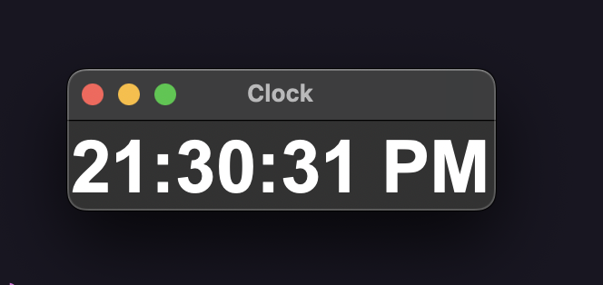

## Relógio em Python 

Exemplo de relógio feito em python


para executar : 
```python pythonclock.py```
ou
```python3 pythonclock.py```

Necessário ter o python instalado
https://www.python.org/downloads/ 